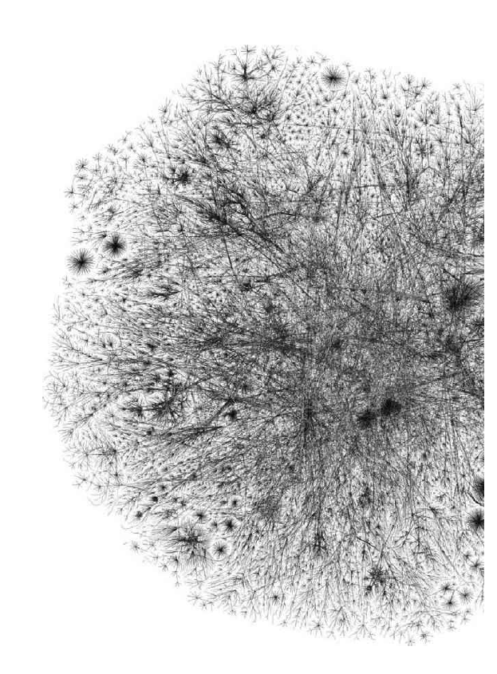
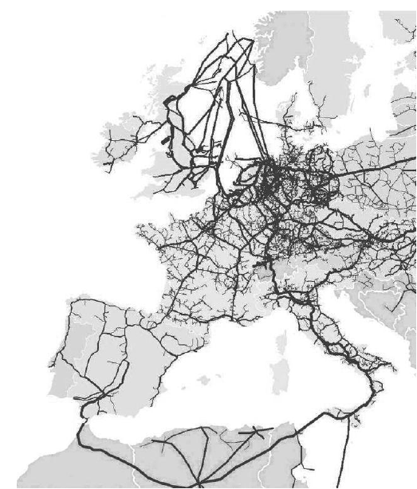
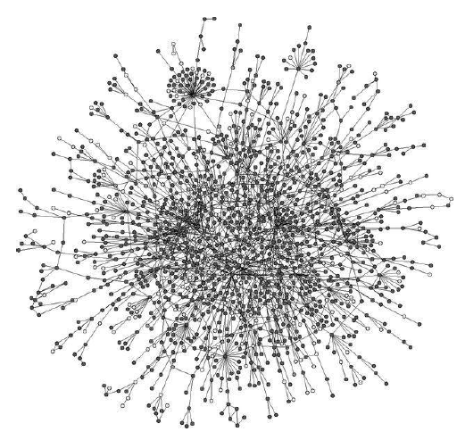
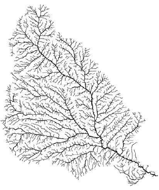
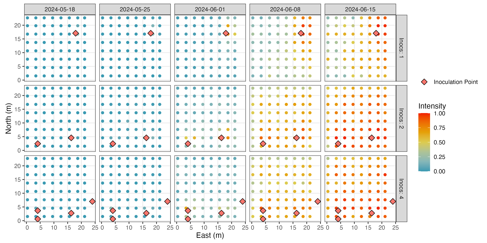
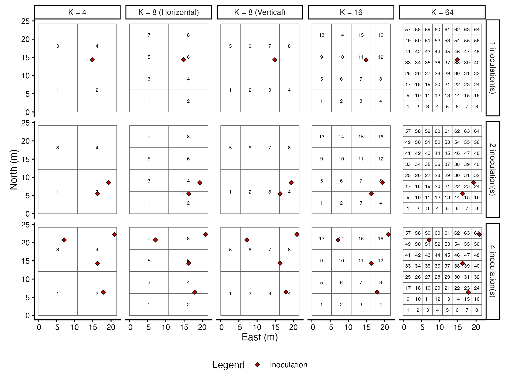
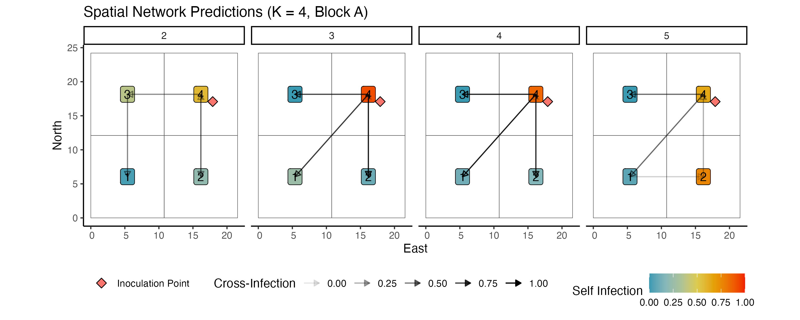
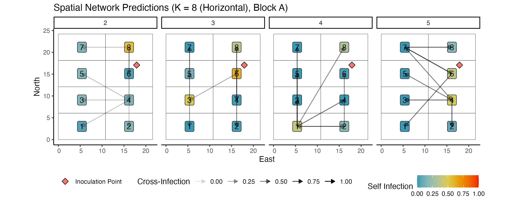
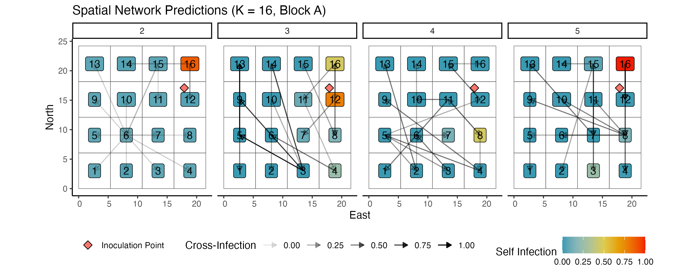
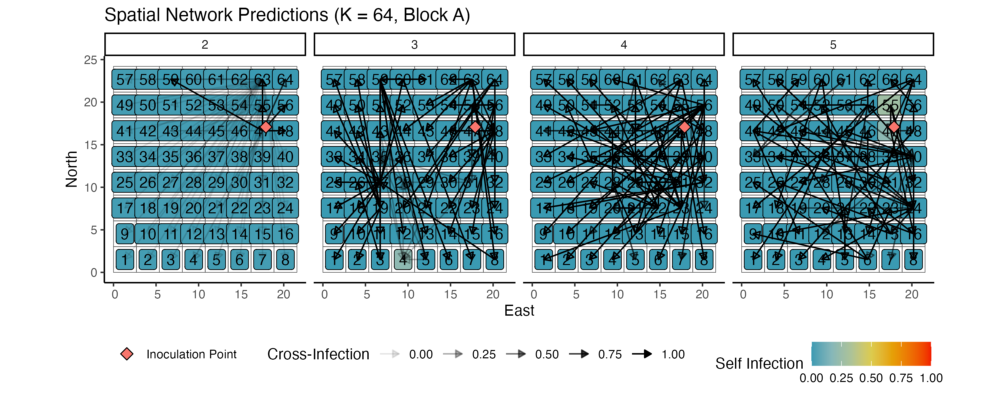

```{r}
#| label: setup
#| include: false

library(igraph)
library(ggraph)
library(tidygraph)
library(tidyverse)
```

# What is a Network? 

## What is a Network?

A **network** or **graph** is a set of *nodes* or *vertices* connected by *edges*.

::: {.r-stretch}
```{r}
#| echo: false
#| fig-height: 6
#| fig-align: "center"
set.seed(42)

#Set the number of nodes
n <- 6

#Generate a rnaodm graph with labels
g <- play_gnp(n, p = 0.25) |>
  mutate(
    label = ifelse(row_number() == 2, "Node", "")
  ) |>
  activate(edges) |>
  mutate(
    label = ifelse(row_number() == 1, "Edge", "")
  )

#Plot the graph
ggraph(g, layout = "auto") +
  geom_edge_link(
    aes(label = label),
    color       = "gray60",
    angle_calc  = "along",
    label_dodge = unit(2.5, "mm"),
    label_size  = 5
  ) +
  geom_node_point(
    size = 15,
    color = "#1C3A5E"
  ) +
  geom_node_text(
    aes(label = label),
    color    = "white",
    size     = 5,
    fontface = "bold",
    na.rm    = TRUE
  ) +
  scale_size_continuous(range = c(4, 10)) +
  theme_graph() +
  theme(legend.position = "none")
```
:::


## Examples of Networks
::: {style="font-size: 0.6em;"}
| Network | Node | Edge |
|---------|--------|------|
| Internet | Computer or router | Cable or wireless data connection |
| World Wide Web | Web page | Hyperlink |
| Citation network | Article, patent, or legal case | Citation |
| Power grid | Generating station or substation | Transmission line |
| Friendship network | Person | Friendship |
| Metabolic network | Metabolite | Metabolic reaction |
| Neural network | Neuron | Synapse |
| Food web | Species | Predation |
:::

Networks are a *conceptual framework*. Many systems may be formatted as networks. 

## Examples of Networks 

::: {layout="[[1,1]]"}
{height=450px width=300px}

{height=450px width=350px}
:::

## Examples of Networks 

::: {layout="[[1,1]]"}
{height=500px width=500px}

{height=500px width=400px}
:::

## Why Do Networks Matter?{style="font-size: 0.75em;"}


We can *learn* about network structure to gain insight about function:

**Observational Data**

- Contact tracing during an outbreak to identify super-spreaders

**Experimentation**

- Which proteins, when disrupted, halt viral replication

**Mechanistic / Physical Properties**

- Which nodes in a hospital ventilation system pose the highest transmission risk


# Measuring Networks {background-color="#1C3A5E"}

## Node-Level Metrics: Centrality {style="font-size: 0.8em;" .noincremental}

::: {.columns}
::: {.column width="40%"}
::: {.nonincremental}
- **Degree Centrality**
  - Number of connections to other nodes
:::
:::
::: {.column width="60%"}
```{r}
#| echo: false
#| fig-height: 5
#| fig-width: 6
set.seed(42)
g <- play_gnp(12, p = 0.3, directed = FALSE) |>
  mutate(degree = centrality_degree())

ggraph(g, layout = "fr") +
  geom_edge_link(color = "gray70", alpha = 0.6) +
  geom_node_point(aes(size = degree, color = degree)) +
  geom_node_text(aes(label = degree), color = "white", fontface = "bold", size = 3.5) +
  scale_size_continuous(range = c(4, 14)) +
  scale_color_gradient(low = "#A8C8E8", high = "#1C3A5E") +
  labs(title = "Degree Centrality") +
  theme_graph() +
  theme(legend.position = "none",
        plot.title = element_text(hjust = 0.5, color = "#1C3A5E", face = "bold"))
```
:::
:::

## Node-Level Metrics: Centrality {style="font-size: 0.8em;"}

::: {.columns}
::: {.column width="40%"}
::: {.nonincremental}
- **Degree Centrality**
  - Number of connections to other nodes

- **Closeness Centrality**
  - Average length of shortest path to all other nodes
:::
:::
::: {.column width="60%"}
```{r}
#| echo: false
#| fig-height: 5
#| fig-width: 6
set.seed(42)
g <- play_gnp(12, p = 0.3, directed = FALSE) |>
  mutate(closeness = centrality_closeness())

ggraph(g, layout = "fr") +
  geom_edge_link(color = "gray70", alpha = 0.6) +
  geom_node_point(aes(size = closeness, color = closeness)) +
  geom_node_text(aes(label = round(closeness, 2)), color = "white", fontface = "bold", size = 3) +
  scale_size_continuous(range = c(4, 14)) +
  scale_color_gradient(low = "#A8C8E8", high = "#1C3A5E") +
  labs(title = "Closeness Centrality") +
  theme_graph() +
  theme(legend.position = "none",
        plot.title = element_text(hjust = 0.5, color = "#1C3A5E", face = "bold"))
```
:::
:::

## Node-Level Metrics: Centrality {style="font-size: 0.8em;"}

::: {.columns}
::: {.column width="40%"}
::: {.nonincremental}
- **Degree Centrality**
  - Number of connections to other nodes

- **Closeness Centrality**
  - Average length of shortest path to all other nodes

- **Betweenness Centrality**
  - How often does a node lie on the shortest path between others?

- **and many, many more...**
:::
:::
::: {.column width="60%"}
```{r}
#| echo: false
#| fig-height: 5
#| fig-width: 6
set.seed(42)
set.seed(42)

# Two cliques connected by a bridge node
clique1 <- make_full_graph(6)
clique2 <- make_full_graph(6)

# Combine and add bridge node
g <- disjoint_union(clique1, clique2) |>
  add_vertices(1) |>
  add_edges(c(1, 13, 7, 13)) |>  # connect both cliques to bridge node 13
  as_tbl_graph() |>
  mutate(betweenness = centrality_betweenness(),
         is_bridge = betweenness == max(betweenness))

ggraph(g, layout = "fr") +
  geom_edge_link(color = "gray70", alpha = 0.6) +
  geom_node_point(aes(size = betweenness, color = is_bridge)) +
  geom_node_text(aes(label = betweenness), color = "white", fontface = "bold", size = 3) +
  scale_size_continuous(range = c(4, 14)) +
  scale_color_manual(values = c("#1C3A5E", "#E76F51")) +
  theme_graph() +
  theme(legend.position = "none")
```
:::
:::


## Edge-Level Metrics: Weight & Direction {style="font-size: 0.8em;" .scrollable}

::: {layout="[[1,1],[1,1]]"}

```{r}
#| echo: false
#| fig-height: 4
#| fig-width: 4
set.seed(2)
g_base <- play_gnp(10, p = 0.3, directed = FALSE)

g_base |>
  ggraph(layout = "fr") +
  geom_edge_link(color = "#2E86AB", alpha = 0.6) +
  geom_node_point(size = 8, color = "#1C3A5E") +
  labs(title = "Unweighted & Undirected") +
  theme_graph() +
  theme(legend.position = "none",
        plot.title = element_text(hjust = 0.5, color = "#1C3A5E", face = "bold", size = 14))
```

```{r}
#| echo: false
#| fig-height: 4
#| fig-width: 4
g_base |>
  activate(edges) |>
  mutate(weight = runif(n(), 0.2, 1)) |>
  ggraph(layout = "fr") +
  geom_edge_link(
    aes(width = weight, alpha = weight),
    color = "#2E86AB"
  ) +
  geom_node_point(size = 8, color = "#1C3A5E") +
  scale_edge_width_continuous(range = c(0.5, 3)) +
  labs(title = "Weighted & Undirected") +
  theme_graph() +
  theme(legend.position = "none",
        plot.title = element_text(hjust = 0.5, color = "#1C3A5E", face = "bold", size = 14))
```

```{r}
#| echo: false
#| fig-height: 4
#| fig-width: 4
g_base |>
  as.directed(mode = "arbitrary") |>
  as_tbl_graph() |>
  ggraph(layout = "fr") +
  geom_edge_arc(
    color    = "#2E86AB",
    alpha    = 0.6,
    arrow    = arrow(length = unit(3, "mm"), type = "closed"),
    end_cap  = circle(5, "mm"),
    strength = 0.2
  ) +
  geom_node_point(size = 8, color = "#1C3A5E") +
  labs(title = "Unweighted & Directed") +
  theme_graph() +
  theme(legend.position = "none",
        plot.title = element_text(hjust = 0.5, color = "#1C3A5E", face = "bold", size = 14))
```

```{r}
#| echo: false
#| fig-height: 4
#| fig-width: 4
g_base |>
  as.directed(mode = "arbitrary") |>
  as_tbl_graph() |>
  activate(edges) |>
  mutate(weight = runif(n(), 0.2, 1)) |>
  ggraph(layout = "fr") +
  geom_edge_arc(
    aes(alpha = weight),
    color    = "#2E86AB",
    arrow    = arrow(length = unit(3, "mm"), type = "closed"),
    end_cap  = circle(5, "mm"),
    strength = 0.2
  ) +
  geom_node_point(size = 8, color = "#1C3A5E") +
  scale_edge_width_continuous(range = c(0.5, 3)) +
  labs(title = "Weighted & Directed") +
  theme_graph() +
  theme(legend.position = "none",
        plot.title = element_text(hjust = 0.5, color = "#1C3A5E", face = "bold", size = 14))
```

:::

# What Does Network Data Look Like? {background-color="#1C3A5E"}

## Two Common Formats{style="font-size: 0.75em;"}

::: {.columns}
::: {.column width="50%"}
**Edge list** 

```{r}
#| echo: false
edge_list <- data.frame(
  node_from = c("A", "A", "B", "C"),
  node_to   = c("B", "C", "D", "D"),
  weight    = c(0.8, 0.3, 0.5, 0.7)
)

knitr::kable(edge_list)
```


:::
::: {.column width="50%"}
**Adjacency matrix**

```{r}
#| echo: false
g <- graph_from_data_frame(edge_list, directed = FALSE)

as_adjacency_matrix(g, sparse = FALSE) |>
  knitr::kable()
```
:::
:::

**Considerations when storing networks:**

- Matrices can become extremely large
  - Need to think about memory usage and algorithm speed
- What if a network is *dynamic*? 
  - Can be stored in long format or as multi-dimensional array

## Working with Networks in R

| Package | Role |
|---------|------|
| `igraph` | [Core graph operations, algorithms](https://igraph.org/){preview-link="true"} |
| `tidygraph` | [Tidy/dplyr-style network manipulation](https://tidygraph.data-imaginist.com/){preview-link="true"} |
| `ggraph` | [ggplot2-based network visualization](https://ggraph.data-imaginist.com/){preview-link="true"} |
| Statnet | [Collection of many analysis tools](https://statnet.org/){preview-link="true"} |
| `visNetwork` | [Interactive network visualization](https://datastorm-open.github.io/visNetwork/){preview-link="true"} |

```{r}
#| eval: false
library(igraph)
library(tidygraph)
library(ggraph)
```

::: {.notes}
Focus on igraph + tidygraph + ggraph as a coherent stack. The others are worth knowing exist.
:::

---

# Visualizing Networks {background-color="#1C3A5E"}

## A Simple Network in `ggraph` {.scrollable}
:::{style="font-size: 0.75em"}
```{r}
#| label: basic-network
#| fig-height: 6
#| fig-width: 10
#| fig-align: "center"
#| code-fold: true

#We are doing something random so set seed
set.seed(404)
#How many nodes?
n <- 10

#Generate a random graph
g <- play_gnp(10, 0.15) |>
  mutate(name = LETTERS[1:n])

#Plot it with ggraph
ggraph(g, layout = "auto") +
  geom_edge_link(color = "gray") +
  geom_node_point(size = 15, color = "#1C3A5E") +
  geom_node_text(aes(label = name), color = "white", fontface = "bold", size = 5) +
  theme_graph()
```
:::

## Why Networks Are Different{style="font-size: 0.75em;"}

- Most data have a natural geometry: 

  - Time series flow left to right, distributions have axes, etc...

- Networks are often **isomorphic**, meaning that the same network may be layed out in different ways. 

::: {.fragment}
**Common layouts and when to use them:**

- **Force-directed** (Fruchterman-Reingold) — general purpose, reveals clusters
- **Circular** — good for showing all nodes, less good for structure
- **Hierarchical** — when there's a clear tree/DAG structure
- **Stress** — Default in `ggraph`
:::


## The Same Graph, Different Layouts{.r-stretch}

```{r}
#| echo: false
#| fig-height: 10
#| fig-width: 12
#| fig-align: "center"

set.seed(404)
g <- play_gnp(10, 0.15) |>
  mutate(name = LETTERS[1:10])

plot_layout <- function(layout, title) {
  ggraph(g, layout = layout) +
    geom_edge_link(color = "gray50") +
    geom_node_point(size = 10, color = "#1C3A5E") +
    geom_node_text(aes(label = name), color = "white", fontface = "bold", size = 3.5) +
    labs(title = title) +
    theme_graph() +
    theme(plot.title = element_text(hjust = 0.5, color = "#1C3A5E", face = "bold", size = 18))
}

library(patchwork)

plot_layout("fr",  "Force-Directed (FR)") +
plot_layout("circle",   "Circular") +
plot_layout("matrix",   "Linear") +
plot_layout("stress",   "Stress") 
```


## Visual Attributes for Network Visualization {style="font-size: 0.6em;"}

:::{.columns}
:::{.column width="50%"}
**Node Attributes** `geom_node_point()`

| Attribute | Values |
|-----------|--------|
| Size | Numeric |
| Color (fill) | Continuous / Categorical |
| Color (border) | Continuous / Categorical |
| Shape | Categorical |
| Label | Character |
| Label size | Numeric |
| Opacity | 0 to 1 |
:::
:::{.column width="50%"}
**Edge Attributes** `geom_edge_link()`

| Attribute | Values |
|-----------|--------|
| Width | Numeric |
| Color | Continuous / Categorical |
| Opacity | 0 to 1 |
| Line type | Solid / Dashed / Dotted |
| Label | Character |
| Label size | Numeric |
| Direction | Arrow / None |
| Curvature | Numeric |
:::
:::


# Source Detection of Aerially Dispersed Plant Pathogens {background-color="#1C3A5E"}

## Background{style="font-size: 0.8em;"}

**Stripe Rust** (*Puccinia striiformis*) is a fungal pathogen of wheat that:

- Spreads via wind over long distances
- Can cause nearly $1 billion in global crop damage annually
- Spreads **anisotropically** via wind.

::: {style="text-align: center;"}
{width="60%" height="350px"}
:::


## The Experimental Setup{style="font-size: 0.6em;"}
**Research Goal**: Determine the epidemic source

- Wheat plots with **1, 2, or 4** inoculation sources
- **4** experimental replicates (blocks A–D)
- **5** weekly visits measuring disease intensity at each sample location
- Disease measured as proportion of infected plant tissue

::: {style="text-align: center;"}
{height="400px"}
:::

## Disease Spread as a Network{style="font-size: 0.6em;"}

The spread of disease between sample locations can be represented as a **directed, weighted network**:

**Nodes:** Sample locations on a spatial grid

**Edges:** Transmission between locations

**Edge weight:** Probability of transmission driven by wind direction, distance, and disease intensity at the previous timepoint. 

::: {style="text-align: center;"}
{height="500px"}
:::

## The Weighted Adjacency Matrix{style="font-size: 0.75em;"}

After fitting the model, we summarize transmission probabilities as a **component-level probability matrix**:

$$
\mathbf{S} = \begin{pmatrix}
0.72 & 0.12 & 0.09 & 0.07 \\
0.08 & 0.65 & 0.18 & 0.09 \\
0.05 & 0.14 & 0.71 & 0.10 \\
0.06 & 0.08 & 0.11 & 0.75
\end{pmatrix}
$$

  - Rows = **infected** component
  - Columns = **source** component  
  - $S_{kk}$ = probability of self-infection
  - $S_{kj}$ = probability of cross-infection from component $j$
  - A single prediction is is obtained by taking the maximum

- This matrix is the network we want to visualize.


## Discussion{style="font-size: 0.65em;"}

Here are my current visualizations from the project:

::: {style="text-align: center;"}

:::

::: {.fragment}
**Some things I'm unsure about:**

- [ ] Is the layout choice working?
- [ ] Are edge weights communicated clearly?
- [ ] What would you want to be able to see that you can't?
- [ ] What's confusing?
:::

## Discussion{style="font-size: 0.75em;"}

::: {style="text-align: center;"}

:::

## Discussion{style="font-size: 0.75em;"}

::: {style="text-align: center;"}

:::

## Network Visualization Gone Wrong{style="font-size: 0.75em;"}

::: {style="text-align: center;"}

:::
---

